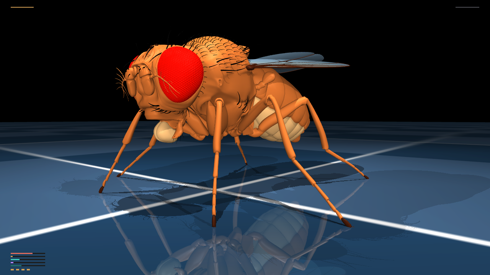

# Project Confluence

**A Phi-vector framework for modeling shared metabolic dynamics across cancer types**

## Abstract

Cancer cells across tissue types converge on shared metabolic reprogramming
patterns (the Warburg effect and its extensions), but most models validate
against synthetic or single-cancer-type data, limiting claims of generality.
Project Confluence models this convergence directly using an ODE-based
state-space system anchored in a five-component Phi-vector - Phi_temporal,
Phi_informational, Phi_functional, Phi_spatial, and Phi_coupling - representing
distinct facets of metabolic-regulatory state.

Six enzymes central to glycolytic and oxidative metabolism (HK2, PKM2, LDHA,
IDH1/2, PDK1, G6PD) are mapped to specific channels in the ODE system as
grounded, biologically-interpretable state variables rather than abstract
parameters.

**Key result:** Replacing synthetic-data validation with six real CCLE
metabolomics channels (`CCLE_metabolomics_20190502.csv`; 225 metabolites x
928 cell lines) raises structurally identifiable parameters from 7/17 to
15/17, evaluated across three cancer types chosen for maximal biological
diversity - AML (blood), osteosarcoma (bone), and NSCLC (lung) - to support
generalizability claims beyond a single tissue context.

An adaptive controller built on this framework extends structurally to
theranostic applications (radioligand diagnostic-therapeutic pairing).

## Citation

See `CITATION.cff`. DOI badge added below once Zenodo publishes.

---

# Confluence v2 — fly mushroom body × cancer microenvironment

> **Computational research / simulation only.** This is not a medical device, not a treatment planner, and it does not claim clinical admissibility or disease eradication. See [DISCLAIMER.md](DISCLAIMER.md).

**Honesty — read this first**

- Confluence is a **research closed-loop**: noisy observations → connectome-style controller → simulated infusion `U(t)` → PK/PD → 15-D cancer ODE (12-D TME/fusion + surveillance / antibody-readiness / dormancy gate). In-silico burden / resistance / fusion-AF / DA / “protein channel” scores are **research numbers**, not a clinical outcome and not a treatment recommendation.
- Fusion proteins in biology arise from **chimeric mRNAs** at a gene junction. Our `T_f` clone, fusion allele fraction, and junction-neoantigen traces are **computational proxies**, not a clinical NGS / ctDNA assay and not a claim that we detected or treated a real fusion.
- Therapeutic chimeric proteins (BiTE-class T-cell engager, IFN-γ, IL-2, anti-PD-1, TGF-β trap, surveillance IgG, fusion mAb) are **simulated infusion / expression rates** from controllers E/F. This is not ribosomal synthesis in Drosophila neurons and not a clinical immune-therapy demo.
- Disease-class labels (`benign`, `malignant`, `occult`, `dormant`, `terminal`) are **state signatures** (distinct X and Y dynamics), not clinical stage or histopathology.
- The hero viewport and `docs/demo/cinematic.mp4` must show the **TuragaLab/flybody** anatomical MuJoCo mesh (`fruitfly.xml`, Apache 2.0; Vaxenburg et al., *Nature* 2025). A CPG / bead-fly stub is **not** an acceptable product visual. If flybody is missing, the UI shows an install CTA instead of a fake fly.
- Visual fidelity requires the flybody extra + headless GL (`MUJOCO_GL=osmesa` or `egl`). NeuroMechFly / FlyGym is an acceptable alternate digital twin only if flybody cannot be installed — document which body is on screen.

Confluence v2 asks a concrete control-theoretic question: *can a Drosophila melanogaster mushroom-body-style associative circuit, driven by noisy cancer observations and a dopamine-like reward, generate adaptive multi-drug infusion policies on a mechanistic tumor microenvironment?*

The closed loop is:

```
Y (noisy, partial) → sensory W_in → AL/LH projection → sparse Kenyon cells
    → MBON rates → motor decode U = clip(W_out · rates, 0)
    → PK  dC_k/dt = −(ln 2 / t½) C_k + U_k(t)
    → 12-D ODE  X = (T_s, T_r, I_act, I_exh, S_fib, L, O, G, C_tgfb, C_ifng, H, T_f)
    → Y′
```

`T_f` is a fusion-oncoprotein clone. Observed `Y` also carries a noisy chimeric-junction / fusion-AF pair (research simulation).

Plasticity on KC→MBON synapses:

```
dW_ij/dt = η · DA(t) · KC_j · MBON_i − λ W_ij
DA(t)    = −Δburden − α · Σ C_k − β · Δresistance − γ · Δfusion_AF
```

Host health `H ∈ [0, 1]`; `H ≤ 0.2` is terminal toxicity. Phenotypic switching `ε_switch(C_drugs, L)` is attenuated by HDAC occupancy. Immune kill is stroma-shielded. Exhaustion `γ_exh` rises with TGF-β, lactate, and unblocked PD-1.

This sits beside the original 16-D Φ / BAC stack in `models/` — v2 does not replace v1; it adds a real-time connectome controller and an interactive session.

## Run the interactive session

```bash
pip install -e .
# or, at minimum:
pip install numpy scipy pydantic fastapi "uvicorn[standard]"

python -m confluence
# equivalent:
uvicorn confluence.telemetry.websocket_server:app --host 127.0.0.1 --port 8765
```

Open **http://127.0.0.1:8765**. The live session is a **dark-lab hero viewport**: the fly fills the frame; cancer burden / resistance, DA, active protein channels, and play/pause sit in a slim HUD. Controllers A–F, full-brain train modes, infusion sliders, and charts stay in the ☰ drawer.

- loop mode is a film-style **Cancer / Flybody / Both** switch (not a form)
- hero viewport streams **only** `env.physics.render` JPEGs from `fruitfly.xml`; no mesh → install CTA (CPG stub is hidden)
- append `?cinema=1` to hide chrome for recording
- append `?demo=immune` to auto-play the fly-brain immune + chimeric-protein demo (research visualization, not a clinical outcome)

[](docs/demo/cinematic.mp4)
[](docs/demo/immune_chimeric.mp4)

Share clip (≈12 s, real mesh): [`docs/demo/cinematic.mp4`](docs/demo/cinematic.mp4). Immune + chimeric-protein demo (controller F, I_act / engager HUD): [`docs/demo/immune_chimeric.mp4`](docs/demo/immune_chimeric.mp4) (`python -m confluence.demo_immune`). Both jobs **fail** if fruitfly.xml cannot render. Research scores, not a clinical outcome. See [`docs/demo/README.md`](docs/demo/README.md).

Interactive Kenyon-cell count defaults to **256** for real-time FPS (documented). Pass `n_kc=2048` in `MushroomBodyNetwork` / controllers for a more FlyWire-like expansion. Controller **F** is a separate sparse rate-based net that can be constructed at `n_neurons=166700` (see below); the UI default stays on the small demo.

```bash
# package tests
python -m pytest tests/test_ode_stability.py tests/test_plasticity_bounds.py tests/test_connectome_loader.py tests/test_flybody_bridge.py tests/test_protein_channels.py tests/test_full_brain_scale.py tests/test_training_smoke.py tests/test_cinematic_render.py tests/test_fusion_biology.py tests/test_immune_chimeric_demo.py tests/test_disease_taxonomy.py tests/test_immune_readiness.py tests/test_validation_suite.py tests/test_clinical_endpoints.py -q

# short controller bake-off (3 archetypes × A–E)
python -m confluence --benchmark --trials 2 --horizon 40
```

Getting-started notebook: [`notebooks/confluence_v2_getting_started.ipynb`](notebooks/confluence_v2_getting_started.ipynb).

## FlyWire stub vs real data

The default graph is a **biologically structured stub**: ~7 PN axons per KC, cholinergic PN→KC, GABAergic APL feedback, dopaminergic DAN→KC/MBON, FlyWire_FAFB_v783 field names on `ConnectomeSubcircuit`. It is **not** a literal Dorkenwald / FlyWire dump.

To ingest real FAFB later:

1. Export `CAVE_TOKEN` (or `FLYWIRE_TOKEN`).
2. Install `caveclient` / `fafbseg`.
3. Implement the reserved path in `confluence/connectome/fafb_loader.py` (`_try_caveclient`) and compile with `CircuitExtractor`.

Without credentials the client stays on the stub and the interactive session still runs.

## Flybody embodiment (optional)

Confluence can also close the loop through a **body**, using the DeepMind / HHMI Janelia [`flybody`](https://github.com/TuragaLab/flybody) MuJoCo Drosophila (Apache 2.0). MBON / `U` outputs map through a documented affine readout into the walking action space (59-D for `walk_imitation`); proprioception is pooled and mixed into sensory `Y` (`Y_mix = (1−α)Y + α Y_proprio`).

This extra is **optional**. The core cancer closed-loop and controllers A–E install and run without MuJoCo.

```bash
# Keep Confluence on numpy 2.x: install flybody *without* its numpy==1.26.4 pin.
sudo apt-get install -y libosmesa6 libosmesa6-dev   # or use EGL
pip install mujoco dm_control h5py mediapy pillow
pip install --no-deps "flybody @ git+https://github.com/TuragaLab/flybody.git@d015e9bfe441bd90ae431bac24c55cb74bdbce26"
# equivalently: bash scripts/install_flybody.sh
export MUJOCO_GL=osmesa
python -m confluence.embodiment --task template --steps 20
python -m confluence.demo_cinematic --seconds 12 --out docs/demo/cinematic.mp4
python -m confluence
```

If flybody / OSMesa is missing, the **hero viewport shows an install CTA** (it does not substitute a stick figure). `python -m confluence.demo_cinematic` exits nonzero rather than writing fake footage. The CPG stub remains only for proprio unit tests (`prefer_real=False`).

Citation (please keep if you use the body model):

```bibtex
@article{flybody,
  title = {Whole-body physics simulation of fruit fly locomotion},
  author = {Roman Vaxenburg and Igor Siwanowicz and Josh Merel and Alice A Robie and
            Carmen Morrow and Guido Novati and Zinovia Stefanidi and Gert-Jan Both and
            Gwyneth M Card and Michael B Reiser and Matthew M Botvinick and
            Kristin M Branson and Yuval Tassa and Srinivas C Turaga},
  journal = {Nature},
  volume = {643},
  pages = {1312--1320},
  year = {2025},
  doi = {https://doi.org/10.1038/s41586-025-09029-4}
}
```

Clocks are independent: cancer time is days; flybody walking control is ~20 ms. Play/pause/step are shared. This remains computational research — not a claim about real fly nervous systems or clinical therapy.

## Full-brain training (N = 166,700) and therapeutic proteins

> **Research simulation only.** The 166,700 units are a **sparse, rate-based controller**, not a multicompartment LIF reconstruction of a fly brain, and **not ribosomes**. Nothing in this loop translates polypeptides or synthesizes drugs. “Proteins that manage therapy” means **simulated PK/PD channels** for antibody-like and cytokine effectors whose infusion / expression *rates* are read out from a dedicated secretory population (or MBON mix). There is no claim of clinical benefit, cellular translation inside Drosophila neurons, or a real FlyWire synapse dump at this scale.

### Scale and memory

The user-named size `FULL_BRAIN_NEURONS = 166700` is a FlyWire-class whole-brain order of magnitude (published adult FlyWire reconstructions are ~10⁵ neurons; this repo does **not** load a CAVEclient materialization unless you add credentials later). Topology here is a **structured sparse stub**: each hidden cell has fan-in 7 from a small PN layer, k-WTA sparsity ~5%, and a compact secretory readout. A dense 166700² float32 matrix would be ~111 GB and is never allocated.

| Mode | `n_neurons` | Typical use | Rough cost |
|------|-------------|-------------|------------|
| Small-net demo (controller E) | 256 KC | Interactive UI, ~12 Hz | few MB |
| Full-brain train (controller F) | 2,048 | UI train mode / smoke | ~few MB, CPU |
| Full-brain 166,700 (controller F) | 166,700 | Headless `train_full_brain` | ~25–40 MB RAM, ~2–10 ms/step on CPU; GPU not required |

Interactive FPS stays on the 256-KC mushroom body. Switching the UI to **Full-brain 166,700** will construct the sparse net in-process and may hitch the browser loop; prefer the CLI for long runs.

### Effector layer (small molecules + biologics + fusion TKIs)

Controllers A–D still emit the original 5-D `U` (`anti_pd1`, `tgfb_inhibitor`, `mct1`, `hdac`, `targeted_kinase`). Controllers **E** and **F** emit all 12 effectors. A documented immune / chimeric secretory prior lifts IFN-γ, IL-2, anti-PD-1, the BiTE-class engager, TGF-β trap, and fusion TKIs when immune competence is low or fusion AF is high. The closed-loop PK state is 12-D (5 small-molecule + 5 protein/biologic + 2 fusion TKI). This is simulated dosing, not a claim that fly neurons translate polypeptides.

| Channel | Simulated class | Notes |
|---------|-----------------|-------|
| `protein_anti_pd1` | checkpoint antibody-like (anti-PD-1) | Complementary occupancy with the 5-D pembrolizumab-class slot |
| `protein_tgfb_trap` | TGF-β neutralizing trap | Slower clearance than galunisertib |
| `protein_ifng` | IFN-γ cytokine | Adds to `C_ifng` production |
| `protein_il2` | IL-2 / fusion-adjacent cytokine | Boosts immune recruitment; higher `tox_weight` |
| `protein_chimeric_engager` | BiTE-class chimeric T-cell engager | Multiplies immune kill; extra pressure on `T_f` (Topp et al. class) |
| `protein_surveillance_igg` | Surveillance IgG-like antibody | Raises `I_surv` / readiness (rituximab-class PK) |
| `protein_fusion_mab` | Fusion-directed monoclonal / bispecific | Extra kill on `T_f` (amivantamab-class) |
| `tki_imatinib_like` | BCR–ABL / KIT / PDGFR-class TKI | Preferential kill on `T_f` (Druker et al. class reference) |
| `tki_alk` | EML4–ALK / ROS1 / NTRK-class TKI | Preferential kill on `T_f` (Kwak et al. class reference) |

Half-lives and organ weights are **simulation-scaled** class references (catalog DOIs), not a dosing protocol. Host-health toxicity uses a per-channel `tox_weight` so biologics do not share small-molecule marrow/cardiac profiles.

### Chimeric fusion biology (research simulation)

Fusion oncoproteins arise from **chimeric mRNAs** at a chromosomal junction (BCR–ABL, EML4–ALK, TMPRSS2–ERG, FGFR3–TACC3, NRG1/NTRK). Confluence adds:

- latent clone `T_f` (12th ODE coordinate; `H` stays at index 10)
- noisy `Y` channels `fusion_allele_fraction` (ctDNA-like) and `junction_neoantigen` (chimeric junction peptide / transcript proxy)
- per-archetype research labels: GBM `fgfr3_tacc3_like`, PDAC `nrg1_ntrk_like`, melanoma `alk_braf_fusion_like`

This is **not** a clinical fusion assay and not patient genotyping. Controllers E/F receive the junction channels in `Y` and can up-weight fusion TKIs when that signal rises; DA includes `−γ Δfusion_AF`.

## Disease taxonomy + immune readiness

Five **state-signature** classes (not cosmetic labels). Mapping: [`confluence/cancer_env/disease_classes.py`](confluence/cancer_env/disease_classes.py) `CLASS_PARAM_MAP`.

| Class | Distinct latent dynamics | Distinct Y signature |
|-------|--------------------------|----------------------|
| `benign` | Low r, low K, high immune kill, low invasion | High-SNR, quiet burden / TGF-β |
| `malignant` | Aggressive growth + evasion (GBM-like) | High bulk Y, low competence |
| `occult` | Moderate growth; clinical visibility Hill is large | Bulk Y attenuated; junction / occult AF leak early |
| `dormant` | Growth × `awake`; stochastic awakening | `dormancy_exit` rises on wake; burden stays low until then |
| `terminal` | High burden, weak host recovery | High Y burden, H already near failure |

Latent extras (indices 12–14): `I_surv` (surveillance priming), `A_ready` (antibody readiness), `awake` (dormancy gate). `H` stays at index 10; `T_f` stays at 11.

Early-warning score (junction, competence drop, occult AF, dormancy-exit) lifts antibody channels on E/F **before** bulk `Y.tumor_burden` explodes. New biologics: `protein_surveillance_igg` (rituximab-class IgG PK), `protein_fusion_mab` (amivantamab-class). Antibodies still load `H` — they can fail the host.

Computational validation (falsifiable, not clinical):

```bash
python -m confluence.benchmarks.validation_suite --out results/validation_taxonomy
```

Notebook: [`notebooks/computational_validation_taxonomy.ipynb`](notebooks/computational_validation_taxonomy.ipynb). Tests: `tests/test_disease_taxonomy.py`, `tests/test_immune_readiness.py`, `tests/test_validation_suite.py`.

## In-silico endpoint mapping / computational–clinical translation layer

**Title of this report:** in silico endpoint mapping / computational–clinical translation layer.

This is **not** a clinical trial, **not** FDA/EMA readiness, and **not** a Phase II readout. RECIST 1.1-*like* and CTCAE v5.0-*like* labels are mappings from the real Confluence closed loop (`CancerODE.ode_system` + observation layer + PK/PD + controllers A / B / E / F). Kaplan–Meier, Mantel–Haenszel log-rank, and univariate Cox HR + 95% CI are **computed**; they are never hardcoded. If the virtual cohort is underpowered, the suite reports the CI and marks the comparison **inconclusive**.

Part 1 — computational stress tests (real `ode_system`, not a standalone Euler toy):

1. **Stiff solver** — LSODA / Radau / RK45 via scipy; trajectory agreement across rtol/atol and effective Δt ∈ [0.001, 0.05]; no NaN/Inf.
2. **Conservation** — X_i ≥ 0; H ∈ [0, 1]; carrying capacity not breached; H ≤ 0.2 ⇒ terminal.
3. **Robustness** — Latin-hypercube virtual cohort N≥100; r, σ_I (κ_immune), t½ perturbed ±25–40%; each patient is run on A (SoC MTD), B (Gatenby adaptive), E and F; report the **distribution**, not one seed.
4. **Weight convergence** — ||W_KC→MBON||_F (plasticity_norm) stays bounded / no runaway.

Part 2 — oncology endpoint *language* mapped from the simulation:

1. **RECIST 1.1-like** — CR / PR (≥30%↓) / SD / PD (≥20%↑ over nadir) from tumor-burden trajectories.
2. **CTCAE v5.0-like** — G0–G5 from H(t) bands (G5 = H ≤ 0.2 terminal).
3. **Kaplan–Meier OS/PFS** + log-rank + Cox HR when feasible, comparing E/F vs A vs B.
4. **Clinical dosing discretization** — continuous U(t) → Q3W anti-PD-1-style pulses and daily TKI/HDAC with 5-on/2-off holidays. These are **simulated regimens**, not labeled schedules.

How to run:

```bash
# translation layer on the real closed loop (N=100 patients × 4 arms)
python3 -m confluence.benchmarks.closed_loop_translation --n 100 --out results/validation_translation

# same layer via the validation-suite entrypoint
python3 -m confluence.benchmarks.validation_suite --clinical --clinical-n 100 --clinical-out results/validation_translation
```

Writes `results/validation_translation/four_panel_endpoints.png` (KM, RECIST bars, CTCAE bars, example trajectory) and `translation_report.json`. Notebook: [`notebooks/computational_clinical_translation.ipynb`](notebooks/computational_clinical_translation.ipynb). Mapper: [`confluence/benchmarks/clinical_endpoint_mapper.py`](confluence/benchmarks/clinical_endpoint_mapper.py). Tests: `tests/test_clinical_endpoints.py`.

Closed loop:

```
Y (cancer ± proprio ± fusion AF / junction) → 166k-scale sparse net → U_small + U_protein + U_fusion
    → first-order PK → 12-D ODE → Y′
```

### Training

Inner loop: existing dopaminergic three-factor rule on the **secretory readout** only (`η · DA · secretory · U − λW`). Outer loop: optional (1+1)-ES weight proposals (`--outer da|es|both`). Checkpoints write `results/full_brain/ckpt.npz` (gitignored `*.npz`).

```bash
# downscaled smoke (CI / laptop)
python -m confluence.train_full_brain --neurons 512 --episodes 2 --days 20

# interactive-scale train
python -m confluence.train_full_brain --neurons 2048 --episodes 8 --days 80

# user-named full size (CPU, sparse rate-based; minutes scale with episodes × days)
python -m confluence.train_full_brain --neurons 166700 --episodes 10 --days 80
```

The UI **Small-net demo / Full-brain train** switch plus **Train episode** runs the same loop on the live session (reward, DA, burden, toxicity, active protein channels).

Provenance: Apache-2.0 flybody remains optional; FlyWire field names stay on the stub schema. Real FAFB ingestion is still the reserved `CAVE_TOKEN` path in `confluence/connectome/fafb_loader.py`. Until that lands, N = 166700 is a **configurable sparse stub**, not Dorkenwald / FlyWire connectivity.

## Controllers (benchmark module)

| ID | Policy | Notes |
|----|--------|-------|
| A | Standard-of-care MTD | Continuous archetype-specific mix |
| B | Gatenby adaptive | Treat to 50% burden drop, halt, resume on recovery |
| C | PPO | Thin trainable stub + optional `CONFLUENCE_PPO_CKPT`; full training is heavy |
| D | Static MB reservoir | Frozen connectome + ridge readout |
| E | Plastic mushroom body | Live DA plasticity (default interactive controller) |
| F | Full-brain secretory | Sparse rate-based net → 5 small-molecule + 4 protein channels; default 2048, configurable 166700 |

Metrics: simulated PFS, resistance emergence time, cumulative toxicity, pharmacological burden. These are **in-silico scores**, not clinical endpoints.

Pharmacology lives in `confluence/pharmacology/drug_catalog.json` (≥10 entries: the original small-molecule / mAb catalog plus four simulated protein/biologic effectors). Half-lives use published DOIs where possible; IC50/MTD/`tox_weight` values are **simulation-scaled**. Controller commands `U∈[0,1]` are clearance-matched so `C_ss = U · MTD` (long-half-life mAbs do not wind up unboundedly).

---


# 🧬 Project Confluence

> ⚠️ Status: Phase 1 computational validation only. No real patient data used.

> **Redefining Precision Oncology: From Tumor Killing to Complexity Restoration**

> Citation and attribution: this repository is MIT-licensed for open review and collaboration. If you use the code, theory, figures, or documentation, please cite the repository and credit Kelechi Ogbonna / cloudynirvana.

> Expert review invited: oncology, systems biology, control theory, clinical trial design, mathematical biology, and research-software reviewers are encouraged to audit assumptions, reproduce simulations, and challenge the validation plan before any translational claims are made.

> External validation preparation: see [validation/external_validation_pipeline.md](validation/external_validation_pipeline.md) for the PhysioNet, GDC, cBioPortal, and Hugging Face data-readiness plan.

[](LICENSE)
[](https://python.org)
[](#validation-roadmap)

---

## Core Hypothesis

Health is not a fixed point but a **Complex Attractor State** characterized by adaptive variability, fractal rhythms, and moderate inter-system coupling. Disease is a transition to pathological attractors. **Therapy should restore the complexity, not just kill the tumor.**

```
Traditional Oncology:   Kill Cancer Cells → Measure Tumor Shrinkage
Project Confluence:     Restore Complexity → Measure Φ Improvement
```

## Theoretical Foundation: Bounded Adaptive Coherence (BAC)

> *A biological system sustains viable complexity if and only if the minimum singular value of its cross-scale coupling tensor exceeds the maximum normalised rate of local entropy production at any organisational scale.*

The BAC framework provides a **first-principles unification** of aging, cancer, and health as states of a single mathematical object — the **coupling tensor** $C(t)$, which governs causal coordination across biological scales (molecular → cellular → tissue → organism → evolutionary).

| Failure Mode | Coupling Tensor Signature | BAC Violation Type |
|---|---|---|
| **Aging** | Global off-diagonal decay of $C_{ij}$ | $\sigma_{\min}(C) \to 0$ uniformly |
| **Cancer** | Selective collapse of organism-scale pairs | $\sigma_{\min}(C) \to 0$ in specific sectors |
| **Health** | BAC condition satisfied with positive margin | $V(t) = \sigma_{\min}(C) - \max_k[\dot{s}_k] > 0$ |

The Φ vector is a **partial measurement** of the coupling tensor — the elements most relevant to cancer pathology. Biologics act as **coupling restoration operators** on specific $C_{ij}$ elements.

📄 **Full derivation:** [theory/bounded_adaptive_coherence.md](theory/bounded_adaptive_coherence.md)

## Unified Complexity Profile (UCP)

The framework operates on two complexity dimensions:

| Dimension | Symbol | Source | Purpose |
|-----------|--------|--------|---------|
| **Clinical Complexity** | Ψ (Psi) | EHR data, staging, genomics | Treatment difficulty |
| **Dynamical Complexity** | Φ (Phi) | Time-series physiology, modeling | Optimization target |

**Φ is a 5D vector:**

| Φ Dimension | Metric | Healthy Range | Biomarker |
|-------------|--------|---------------|-----------|
| Φ_temporal | Multiscale Entropy | 0.6–0.8 | HRV, glucose variability |
| Φ_spatial | Correlation Dimension D₂ | 3.0–6.0 | Cell diversity |
| Φ_functional | Recovery rate | 0.5–0.8 | Stress response |
| Φ_informational | λ_max + spectral slope | 0.5–0.7 | Signal entropy |
| Φ_coupling | Cross-system correlation | 0.4–0.7 | Immune-metabolic sync |

## Architecture

```
┌─────────────────┐     ┌──────────────────┐     ┌──────────────┐     ┌────────────────┐
│ Bioinformatics  │────▶│   Complexity     │────▶│   Patient    │────▶│     RADO       │
│     Miner       │     │   Profiler       │     │   Fitter     │     │    Engine      │
│   (Module 4)    │     │   (Module 1)     │     │  (Module 2)  │     │   (Module 3)   │
└─────────────────┘     └──────────────────┘     └──────────────┘     └────────────────┘
   TCGA/cBioPortal         5D Φ vector            Digital Twin         Optimized Protocol
   Omics extraction        Archetype ID           Bayesian MCMC        Complexity restoration
```

## Adaptive Therapy Controller (NEW)

> *"The optimal therapy is an algorithm, not a prescription."* — First Principles Deconstruction, Axiom 10

Project Confluence now includes a **closed-loop adaptive therapy controller** that treats dosing as a real-time policy decision, not a fixed protocol.

### Key Innovation

Instead of optimizing for a static dose (e.g., "DCA at 25mg for 60 days"), the system optimizes the **hyperparameters of an adaptive policy** — when to dose, when to hold, and how to respond to resistance signals.

```
Traditional:  Optimizer → Fixed Dose Schedule → Patient
Confluence:   Optimizer → Adaptive Policy π(state) → Dynamic Dosing → Patient
```

### Three Policy Modes

| Mode | Description | Use Case |
|------|-------------|----------|
| **Threshold** | Bang-bang control with hysteresis | Simple on/off dosing |
| **Proportional** | Dose scales with tumor burden | Continuous dose adjustment |
| **RobustAdaptive** | Threshold + resistance-aware + uncertainty margins | Full Confluence policy |

### Safety Constraints (Assurance Layer)

All policies are bounded by hard safety constraints that **cannot be overridden**:
- Absolute dose cap (robust_max_dose)
- Forced drug holidays after max continuous dosing
- Minimum holiday duration
- Cumulative toxicity budget

### Monte Carlo Validation: 200 Uncertain Biological Scenarios

| Metric | MTD (Standard Care) | Confluence Adaptive |
|--------|---------------------|---------------------|
| **Resistant Takeover Rate** | 178/200 (89.0%) | **1/200 (0.5%)** |
| **Tumor Controlled at Day 180** | 200/200 (100%) | 36/200 (18.0%) |
| **Mean Final Tumor Burden** | 0.271 | 0.952 |
| **Mean Final Resistant Fraction** | 91.5% | **11.9%** |

The adaptive policy achieves near-zero resistant takeover (1/200 scenarios) across 200 random biological parameter sets sampled from the uncertainty set. The tradeoff is explicit: it preserves evolutionary containment at the cost of short-horizon tumor shrinkage. MTD keeps burden smaller but selects for resistance in 89% of scenarios. The adaptive controller maintains sensitive-cell competitive suppression of resistant clones — the ecological mechanism adaptive therapy is designed to exploit.

```bash
# Run the comparison
python validate_controller.py

# Run full Monte Carlo analysis (200 samples, ~5 min)
python scripts/monte_carlo_uncertainty.py
```

### Mathematical Core — 15D SAEM Model

The patient state **z** ∈ ℝ¹⁵ evolves under:

```
dz/dt = F(z, θ, u)

Metabolic (10D):     Glucose, Lactate, Pyruvate, ATP, NADH,
                     Glutamine, Glutamate, αKG, Citrate, ROS
Immune (3D):         I_eff, I_reg, I_exhaust
Microenvironment (2D): σ_stromal, ν_vascular
```

Nonlinearity via Michaelis-Menten kinetics → **strange attractor dynamics**.

```mermaid
graph TD
    subgraph Scale 0: Molecular (z0-z4)
        M1[Glucose/Lactate Flux] <--> M2[ATP/NADH Energetics]
    end

    subgraph Scale 1: Cellular (z5-z9)
        C1[Glutamine/alpha-KG] <--> C2[ROS Accumulation]
    end

    subgraph Scale 2: Organismal (z10-z12)
        O1[Effector T-Cells] <--> O2[Tregs / Exhaustion]
    end

    subgraph Scale 3: Tissue (z13-z14)
        T1[Stromal Density] <--> T2[Vascular Integrity]
    end

    %% Cross-Scale Coupling Tensor Channels C_ij
    M2 -- "C_01 (Metabolic feedback)" --> C2
    C2 -- "C_12 (Stress-immune gating)" --> O1
    O2 -- "C_23 (Immune-stroma pruning)" --> T1
    T2 -- "C_30 (Vascular glucose supply)" --> M1
```

## Quick Start

```bash
# Clone
git clone https://github.com/cloudynirvana/project-confluence.git
cd project-confluence

# Install (v2 interactive extras are in pyproject.toml / requirements.txt)
pip install -e .
pip install -r requirements.txt

# Interactive closed-loop session (primary v2 demo)
python -m confluence
```

# Run complexity profiling
python -c "
from models.complexity_profiler import ComplexityProfiler
from models.ode_system import ComplexAttractorODE

ode = ComplexAttractorODE()
result = ode.solve(t_span=(0, 200), dt_eval=0.5)
profiler = ComplexityProfiler()
phi = profiler.profile(result['z'], dt=0.5)
print(phi.to_json())
"
```

## Convergence Implementation Status

The current computational stack now implements the four Codex convergence prompts:

| Layer | Implementation | Verification |
|-------|----------------|--------------|
| Quantum scale k0 | `ComplexAttractorODE` is extended to 16D with `psi_coherent`; `CouplingTensorAnalyzer` computes a 5-scale tensor and direct `C_02` quantum-to-cellular coupling. | `tests/test_ode_system.py`, `tests/test_coupling_tensor.py` |
| OSKM steering | `PolicyMode.EPIGENETIC_STEERING` emits pulsatile OSKM dosing from identity metrics with Landauer thermal override holidays. | `tests/test_adaptive_controller.py` |
| Curvature bottlenecks | `scripts/detect_curvature_bottlenecks.py` exports a Forman-Ricci JSON report and network plot for cellular-organismal bottlenecks. | `results/curvature_bottlenecks/` |
| Memory-kernel EKF | `ExtendedKalmanFilterObserver` estimates `[z, vec(M_neural)]` and accepts DMN coherence plus EEG PCI measurement channels. | `tests/test_optimal_inference.py` |

Focused validation:

```bash
python -B -m pytest tests/test_adaptive_controller.py tests/test_ode_system.py tests/test_coupling_tensor.py tests/test_optimal_inference.py -q
python -B scripts/detect_curvature_bottlenecks.py
```

## PDAC Rogue Closure Model

Project Confluence now includes a disease-specific executable scaffold for pancreatic ductal adenocarcinoma (PDAC):

```text
PDAC persistence = KRAS/RAS driver closure
                 + EGFR/STAT3 bypass recovery
                 + stromal/glycocalyx shielding
                 + immune exclusion
                 + therapy-selected resistance
```

Run the synthetic workflow:

```bash
python scripts/run_pdac_rogue_closure.py --all-scenarios
```

Validation data links and the real-data plan are in [`validation/pdac_data_sources.md`](validation/pdac_data_sources.md). The committed PDAC time series in `results/pdac_rogue_closure/` is synthetic and exists for reproducibility; raw public datasets should be fetched from GDC, cBioPortal, GEO, DepMap, PDMR, PDX Finder, GlyGen, and GlyConnect rather than stored directly in the repository.


## 🦞 AutoResearchClaw Integration

Generate a full conference paper from Project Confluence's models with one command:

```bash
python scripts/run_autoresearch.py phi-universality
python scripts/run_autoresearch.py --list-topics
```

**Pre-built topics:** phi-universality · drug-scheduling · immune-metabolic · ferroptosis-complexity · digital-twin

AutoResearchClaw runs 23 stages autonomously — literature review, hypothesis debate, experiments using Confluence's ODE system, peer review, and LaTeX paper. No GPU required.

**Config:** config.arc.yaml | **Prompts:** prompts.confluence.yaml

## Repository Structure

```
project-confluence/
├── confluence/                      # v2 installable package
│   ├── contracts.py                 # Pydantic: LatentCancerState, Observation, drugs, MB circuit
│   ├── loop.py                      # Closed loop Y → controller → PK → ODE
│   ├── connectome/                  # FlyWire stub + FAFB loader hook + circuit_extractor
│   ├── neural_engine/               # Rate MB network + DA plasticity
│   ├── cancer_env/                  # 12-D ODE (TME + fusion clone), observation layer, 3 archetypes
│   ├── pharmacology/                # drug_catalog.json, PK/PD, toxicity
│   ├── controllers/                 # A MTD · B Gatenby · C PPO stub · D reservoir · E plastic MB
│   ├── benchmarks/                  # PFS / resistance / toxicity runner
│   ├── telemetry/                   # FastAPI + WebSocket UI
│   └── embodiment/                  # Optional flybody (MuJoCo) bridge + kinematic stub
├── notebooks/                       # Getting-started notebook
├── models/                          # Core computational modules (v1 Φ / BAC stack)
│   ├── adaptive_controller.py       # Closed-loop adaptive therapy controller
│   ├── clonal_dynamics.py           # Lotka-Volterra clonal competition engine
│   ├── resistance_model.py          # Multi-mechanism resistance tracker
│   ├── complexity_profiler.py       # Module 1: 5D Φ vector
│   ├── patient_fitter.py            # Module 2: Bayesian digital twin
│   ├── drug_optimization_engine.py  # Module 3: RADO engine
│   ├── ode_system.py                # 15D SAEM ODE
│   ├── immune_dynamics.py           # Immune force field
│   ├── intervention.py              # Drug library (20+ drugs)
│   ├── geometric_optimization.py    # Basin curvature, Kramers escape, Flatten-Heat-Push
│   ├── geometric_pathways.py        # Freidlin-Wentzell MAP via String Method
│   ├── fisher_geometry.py           # Fisher Information Matrix / stiff-sloppy (MBAM)
│   ├── network_curvature.py         # Forman-Ricci curvature bottleneck detection
│   ├── realistic_failure.py         # Stochastic failure model
│   ├── ferroptosis.py               # Iron-dependent cell death
│   ├── coupling_tensor.py           # Block Jacobian cross-scale C_ij tensor
│   ├── optimal_inference.py         # EKF state & coupling tensor observer
│   ├── lyapunov_certificate.py      # Universal Complexity Sustainment — CLF certifier
│   └── identity_tensor.py           # Φ-Unification Identity Tensor — consciousness preservation
├── scripts/
│   ├── monte_carlo_uncertainty.py   # 200-sample uncertainty validation
│   ├── test_pathways.py             # Geometric calibration integration test
│   ├── test_sustainment.py          # Sustainment Theorem validation (4 scenarios)
│   ├── test_identity.py             # Identity Tensor validation (5 scenarios)
│   ├── clonal_evolution_sim.py      # Adaptive vs MTD comparison
│   ├── confluence_runner.py         # Full pipeline runner
│   ├── optimize_biomarker_panel.py  # EKF biomarker selection optimization
│   └── ...                          # Data agents, validation scripts
├── agents/                          # Data agents
│   └── bioinformatics_miner.py      # Module 4: TCGA/cBioPortal
├── validation/                      # Safety & reference data
│   ├── clinical_guardrails.json     # CTCAE v5.0 constraints
│   └── gene_to_parameter_map.json   # Omics → ODE mapping
├── theory/                          # Mathematical framework
│   ├── age_reversal_transfer.md          # Scaling BAC & C_ij framework to biogerontology
│   ├── bounded_adaptive_coherence.md     # BAC first-principles theory
│   ├── complexity_sustainment.md         # Optimal complexity maintenance (cancer vs aging)
│   ├── optimal_inference_design.md       # Inference of C_ij from sparse clinical observations
│   ├── sustained_complexity_and_death.md # Biophysics & thermodynamics of death
│   ├── deepmind_executive_brief.md       # Proposal for DeepMind & Isomorphic Labs integration
│   ├── geometric_calibration_research.md  # Geometric calibration research proposal
│   ├── quantum_criticality_and_unison.md  # Penrose Orch OR × BAC quantum-classical integration
│   ├── universal_sustainment_theorem.md   # Control Lyapunov proof for indefinite sustainment
│   └── consciousness_complexity_bridge.md  # IIT × BAC Φ-Unification — identity preservation theory
├── tests/                           # Test suite (11 test files)
├── docs/                            # User documentation
└── notebooks/                       # Validation pipelines
```

## 🗺️ Mathematical-to-Code Mapping Registry

To bridge abstract biophysical theory with verified computational executions, use the following translation map linking the mathematical papers to their Python modules:

| Biophysical Equation / Concept | Mathematical Theory Paper | Executable Python Module | Verification Test Suite |
| :--- | :--- | :--- | :--- |
| **16D Spectral Attractor (SAEM + k0)** | [`theory/optimal_inference_design.md`](theory/optimal_inference_design.md), [`theory/quantum_criticality_and_unison.md`](theory/quantum_criticality_and_unison.md) | [`models/ode_system.py`](models/ode_system.py) | `tests/test_ode_system.py` |
| **5x5 Cross-Scale Coupling Tensor $C_{ij}$** | [`theory/complexity_sustainment.md`](theory/complexity_sustainment.md) | [`models/coupling_tensor.py`](models/coupling_tensor.py) | [`tests/test_coupling_tensor.py`](tests/test_coupling_tensor.py) |
| **EKF Observer + Memory Kernel $M(t)$** | [`theory/optimal_inference_design.md`](theory/optimal_inference_design.md), [`theory/consciousness_complexity_bridge.md`](theory/consciousness_complexity_bridge.md) | [`models/optimal_inference.py`](models/optimal_inference.py) | [`tests/test_optimal_inference.py`](tests/test_optimal_inference.py) |
| **OED Sensor Selection Matrix $H$** | [`theory/optimal_inference_design.md`](theory/optimal_inference_design.md) | [`scripts/optimize_biomarker_panel.py`](scripts/optimize_biomarker_panel.py) | *Runs combinatorial validation* |
| **Stochastic Laboratory Calibration** | [`theory/problem_statement_and_justification.md`](theory/problem_statement_and_justification.md) | [`scripts/stochastic_noise_sweep.py`](scripts/stochastic_noise_sweep.py) | *Assay noise sweeps* |
| **Universal Sustainment Theorem (CLF)** | [`theory/universal_sustainment_theorem.md`](theory/universal_sustainment_theorem.md) | [`models/lyapunov_certificate.py`](models/lyapunov_certificate.py) | [`scripts/test_sustainment.py`](scripts/test_sustainment.py) |
| **Φ-Unification (IIT × BAC Bridge)** | [`theory/consciousness_complexity_bridge.md`](theory/consciousness_complexity_bridge.md) | [`models/identity_tensor.py`](models/identity_tensor.py) | [`scripts/test_identity.py`](scripts/test_identity.py) |
| **Bioinformatics Parameter Mapping** | [`theory/geometric_calibration_research.md`](theory/geometric_calibration_research.md) | [`agents/bioinformatics_miner.py`](agents/bioinformatics_miner.py) | `tests/test_bioinformatics.py` |
| **Genomic Cohort Reconstructor** | [`theory/problem_statement_and_justification.md`](theory/problem_statement_and_justification.md) | [`scripts/reconstruct_tcga_patients.py`](scripts/reconstruct_tcga_patients.py) | *TCGA diagnostic outputs* |

## Pan-Cancer Support

| Cancer Type | Metabolic Profile | Key Vulnerability |
|-------------|-------------------|-------------------|
| TNBC | Warburg + glutamine addiction | Glycolysis inhibition |
| PDAC | Extreme glycolysis + stromal barrier | Stromal depletion |
| NSCLC | Moderate glycolysis | OXPHOS targeting |
| Melanoma | OXPHOS-dependent | ETC inhibition |
| GBM | High glycolysis + neurotransmitter crosstalk | Glucose deprivation |
| CRC | MSI-H, moderate Warburg | Immunotherapy + metabolic |
| HGSOC | Glutamine-dependent | GLS1 inhibition |
| mCRPC | Lipogenesis from citrate | Citrate diversion block |
| AML | OXPHOS + glutamine | Combined metabolic attack |
| HCC | Extreme Warburg + lipogenesis | Multi-pathway inhibition |

## 📢 Call for Data

We are seeking **longitudinal pathology and omics datasets** to validate Confluence across oncology, metabolic disease, and comorbidities. Static snapshots are insufficient — we need time-series data that allows reconstruction of complexity profiles.

**We welcome:** Cancer time-series · Diabetes/metabolic longitudinal data · Comorbidity cohorts · **Negative results**

📄 **Full details:** [CALL_FOR_DATA.md](CALL_FOR_DATA.md)
📋 **Submission template:** [data_submission_template.json](validation/data_submission_template.json)
🔬 **What we measure:** [complexity_signature.md](validation/complexity_signature.md)

### Three-Arm Validation Strategy

| Arm | Goal | Success Metric |
|-----|------|----------------|
| **Separate** | Confluence works on Cancer *and* Diabetes individually | Same equations identify tipping points in both |
| **Conjoined** | Handles coupled comorbidity systems | Predicts cross-domain interaction effects |
| **Universality** | Mathematics is disease-agnostic | Φ recovery profiles statistically indistinguishable |

📋 **Full protocol:** [validation_protocol.md](validation/validation_protocol.md)

## Validation Roadmap

| Phase | Description | Status |
|-------|-------------|--------|
| **Phase 1** | Computational validation (1000-trial Monte Carlo) | ✅ Complete |
| **Phase 1b** | Adaptive therapy Monte Carlo (200 uncertain scenarios) | ✅ Complete |
| **Phase 2** | Retrospective validation (TCGA complexity vs. survival) | 🔄 In Progress |
| **Phase 2b** | Cross-disease complexity validation (3-arm protocol) | 📢 Call for Data posted |
| **Phase 3** | Prospective wet-lab (collaborator-dependent) | ⏳ Planned |

## Validation Walkthrough (Phase 1 Snapshot)

Results below are from `scripts/disease_poc.py` with output captured in `poc_results.txt`.

| Disease | |Phi| | Coherence | Dist. from Healthy |
|---------|------|-----------|--------------------|
| Healthy | 1.3199 | 0.2628 | -- |
| Glioblastoma | 1.5577 | 0.5593 | 0.6732 |
| TNBC | 1.4490 | 0.5014 | 0.5794 |
| Alzheimers | 1.3028 | 0.3650 | 0.3792 |
| Nephroblastoma | 1.3486 | 0.3473 | 0.2932 |
| Diabetes | 1.3547 | 0.3649 | 0.2404 |
| Parkinsons | 1.2171 | 0.2355 | 0.2059 |
| Lupus | 1.2522 | 0.2015 | 0.1574 |
| ALS | 1.2769 | 0.1982 | 0.1507 |

In this snapshot, Glioblastoma is the furthest from healthy (0.6732), exceeding TNBC.
Lupus shows the lowest coherence (0.2015), aligned with the autoimmune hyperactivation settings in `LupusParams`.
ALS and Lupus are closest to healthy (0.1507 and 0.1574), indicating subtle early-stage deviations in this model.

TNBC vs Nephroblastoma distance: 0.3076.

Per-dimension divergence (TNBC vs Nephroblastoma):

| Dimension | Healthy | TNBC | Nephro | D(TNBC-Nephro) |
|-----------|---------|------|--------|----------------|
| Phi_temporal | 0.4897 | 0.3901 | 0.3684 | 0.0217 |
| Phi_spatial | 0.2786 | 0.3224 | 0.3191 | 0.0033 |
| Phi_functional | 0.9757 | 0.9829 | 0.9871 | 0.0042 |
| Phi_informational | 0.2882 | 0.8267 | 0.5434 | 0.2833 |
| Phi_coupling | 0.6242 | 0.4403 | 0.5581 | 0.1178 |

Therapeutic simulation (Nephroblastoma):

| Intervention | Phi-distance (pre) | Phi-distance (post) | Restoration | Notes |
|--------------|--------------------|---------------------|-------------|-------|
| IGF2R monotherapy (IGF2_signaling: 0.75 -> 0.30) | 0.2932 | 0.2302 | 21.5% | 3/5 dimensions shift toward healthy |
| IGF2R + WT1 mRNA (WT1_activity: 0.20 -> 0.55) | 0.2932 | 0.2186 | 25.5% | 4.0% synergy gain vs mono |

TCGA retrospective (Track A, synthetic cohort):

| Disease | Phi-dist | Survival (d) | Spearman rho | HR |
|---------|----------|--------------|--------------|----|
| TNBC | 0.4869 | 275 | -0.8220 | 9.83 |
| Alzheimers | 0.3871 | 1005 | -0.9181 | 1.29 |
| ALS | 0.1769 | 1078 | -0.8358 | 1.24 |
| Diabetes | 0.2042 | 1532 | -0.7753 | 1.17 |
| Parkinsons | 0.1796 | 1486 | -0.7904 | 1.07 |
| Nephroblastoma | 0.2811 | 1338 | -0.3437 | 1.04 |
| Lupus | 0.1934 | 1612 | -0.7566 | 1.13 |
| Glioblastoma | 0.6195 | 387 | -0.8376 | 1.95 |

Overall Spearman rho (240 patients): -0.7937.
Glioblastoma now shows a strong negative rho after scaling, consistent with its aggressiveness.

Reproduce locally:

```bash
python scripts/disease_poc.py > poc_results.txt 2>&1
```

```bash
python scripts/tcga_retrospective.py > tcga_output.txt 2>&1
```

TCGA retrospective results are saved to `results/tcga_val/retrospective_metrics.json`.

Track B ingestion (longitudinal cohort):

```bash
python scripts/tcga_track_b.py --input data/track_b/mock_cohort.json
```

Track B results are saved to `results/tcga_val/track_b_metrics.json`.
Use `--use-neural-ode` to reconstruct trajectories if torchdiffeq is installed.
Note: With fewer than 3 patients, Spearman rho is not statistically meaningful (2-point rho will be ±1 by definition).

To generate a pinned lockfile (`requirements.lock.txt`) on a machine with Python installed:

```powershell
powershell -File scripts/pin_requirements.ps1
```

## Safety & Regulatory

- All protocols constrained by `clinical_guardrails.json` (CTCAE v5.0)
- Φ dimensions mapped to LOINC / SNOMED-CT codes
- FDA MIDD (Model-Informed Drug Development) aligned
- See [DISCLAIMER.md](DISCLAIMER.md) for medical use limitations

## 🇳🇬 Nigeria Clinical Guidelines Integration

Project Confluence integrates the **Nigeria Standard Treatment Guidelines (NSTG 2022)** — 270 structured clinical conditions published by the Federal Ministry of Health, Nigeria — as a RAG (Retrieval-Augmented Generation) layer for guideline-aware precision oncology.

> **Data Source**: [chisomrutherford/nigeria-clinical-guidelines-dataset](https://huggingface.co/datasets/chisomrutherford/nigeria-clinical-guidelines-dataset)
> **License**: CC-BY-4.0 | **Curated by**: Chisom Rutherford

### What This Adds

| Feature | Description |
|---------|-------------|
| **NigeriaGuidelineRetriever** | Semantic search (RAG) over all 270 NSTG conditions with FAISS + sentence-transformers |
| **Nigeria-Specific Guardrails** | Adjusted safety thresholds for malaria, HIV, sickle cell, anaemia comorbidities |
| **Guideline-Aware Controller** | Adaptive therapy controller with NSTG 2022 safety layer |
| **Resource-Aware Dosing** | Drug availability tiers (commonly/intermittently/rarely available in Nigeria) |
| **Clinical Query API** | FastAPI endpoints for real-time guideline retrieval |

### Quick Start

```python
from agents.nigeria_guideline_retriever import NigeriaGuidelineRetriever

# Initialize (downloads from HuggingFace on first run, or uses built-in mock data)
retriever = NigeriaGuidelineRetriever()

# Semantic search
results = retriever.retrieve("first-line treatment for breast cancer in Nigeria")
for r in results:
    print(f"[{r.score:.3f}] {r.chunk.condition_name}: {r.chunk.text[:100]}")

# Structured clinical answer
print(retriever.answer("What is the dosing for cisplatin in cervical cancer?"))

# Direct protocol lookup
protocol = retriever.get_treatment_protocol("BREAST CANCER")

# Drug-specific constraints
constraints = retriever.get_dosing_constraints("doxorubicin")
```

### Guideline-Aware Adaptive Controller

```python
from models.adaptive_controller import AdaptiveController, PolicyMode

# Controller auto-loads Nigeria guardrails if JSON exists
controller = AdaptiveController(
    policy_mode=PolicyMode.ROBUST_ADAPTIVE,
    guideline_retriever=retriever,
    cancer_type="TNBC",
)

# Summary includes Nigeria guidelines status
print(controller.get_summary())
# → {"nigeria_guidelines_active": true, ...}
```

### API Endpoints

```bash
# Query guidelines (semantic search)
curl -X POST http://localhost:8000/guideline_query \
  -H "Content-Type: application/json" \
  -d '{"query": "management of neutropenia during chemotherapy", "top_k": 5}'

# List all 270 conditions
curl http://localhost:8000/guideline_conditions

# Get specific protocol
curl http://localhost:8000/guideline_protocol/breast%20cancer

# Get drug constraints
curl http://localhost:8000/guideline_drug/doxorubicin
```

### Install Optional Dependencies

```bash
pip install sentence-transformers faiss-cpu datasets
```

Without these, the retriever falls back to TF-IDF/keyword matching (still functional, lower accuracy).

## Contributing

We welcome contributions from computational biologists, oncologists, and dynamical systems researchers. See [CONTRIBUTING.md](CONTRIBUTING.md) for guidelines.

## Citation

```bibtex
@software{ogbonna2026confluence,
  author = {Ogbonna, Kelechi},
  title = {Project Confluence: Complexity-Restoring Precision Oncology Framework},
  year = {2026},
  url = {https://github.com/cloudynirvana/project-confluence}
}
```

## License

MIT License — see [LICENSE](LICENSE) for details.

## Disclaimer

This is a **research framework** for computational exploration. It is **not** a medical device, clinical decision support system, or diagnostic tool. See [DISCLAIMER.md](DISCLAIMER.md).

---

*"The measure of health is not the absence of disease, but the presence of complexity."*
