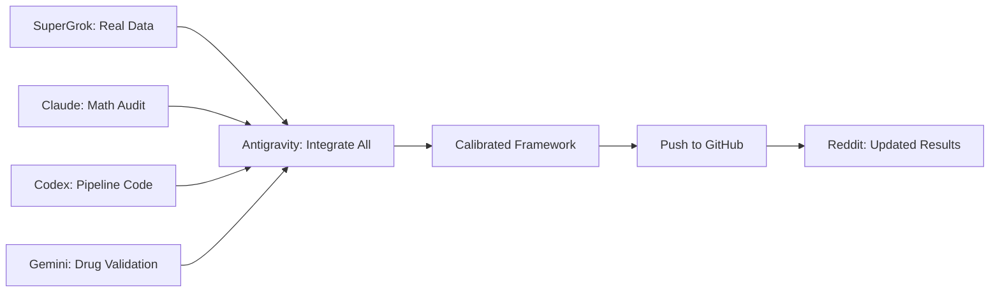

# 🤖 AI Collaboration Playbook — Project Confluence Real Data Integration

> **Purpose:** Ready-to-use prompts for multiple AI systems, each targeting their unique strengths. Copy-paste these into SuperGrok, Codex, Claude, or Gemini to get domain-specific contributions.

## Strategy: Divide and Conquer

| AI System | Task | Why This AI? |
|---|---|---|
| **SuperGrok** | Live PubMed literature review + real metabolomics data retrieval | Real-time web access, X/scientific community connections |
| **Claude** | Mathematical audit of Kramers theory application + generator matrix validation | Deep reasoning, long-context analysis |
| **Codex / ChatGPT** | Code generation for data pipeline + automated testing | Strong code generation, API integration |
| **Gemini** | Cross-reference drug effects against clinical trial databases | PubMed/Scholar integration, multimodal |
| **You (Antigravity)** | Build the pipeline code, integrate responses, maintain repo | Full codebase access, file system control |

---

## 🔴 PROMPT 1: SuperGrok — Real Metabolomics Data Retrieval

**Copy this entire prompt into SuperGrok:**

```
I'm building a computational cancer therapy optimization framework called Project Confluence. It models cancer metabolic states using 10 metabolites in a 10×10 ODE system:

METABOLITES = ["Glucose", "Lactate", "Pyruvate", "ATP", "NADH", "Glutamine", "Glutamate", "α-KG", "Citrate", "ROS"]

The framework currently uses hand-tuned generator matrices based on literature values. I need to ground these in REAL DATA.

TASK 1: Find me the actual measured metabolite concentrations (or relative abundances) for these 10 metabolites across these cancer cell lines:

| Cancer Type | Representative Cell Lines |
|---|---|
| TNBC | MDA-MB-231, MDA-MB-468, HCC1937 |
| PDAC | PANC-1, MIA PaCa-2, BxPC-3 |
| NSCLC | A549, H1299, H460 |
| Melanoma | A375, SK-MEL-28, WM266-4 |
| GBM | U87, U251, T98G |
| CRC | HCT116, SW480, HT-29 |
| HGSOC | SKOV3, OVCAR3, A2780 |
| mCRPC | PC3, DU145, LNCaP |
| AML | HL-60, MOLM-13, OCI-AML3 |
| HCC | HepG2, Huh7, SNU-449 |

For metabolites not directly measurable (ATP, NADH, ROS), provide the best proxy measurements:
- ATP: ATP/ADP ratio or total adenylate charge
- NADH: NAD+/NADH ratio
- ROS: GSH/GSSG ratio, or DCFDA fluorescence values

TASK 2: Find published 13C-glucose and 13C-glutamine isotope tracing flux data for at least 3 of these cancer types. I need:
- Glycolysis flux rate (glucose → pyruvate → lactate)
- TCA cycle flux (pyruvate → citrate → α-KG)
- Glutaminolysis flux (glutamine → glutamate → α-KG)

These fluxes map directly to entries in my 10×10 generator matrix:
- A[0,2] = glycolysis flux (Glucose → Pyruvate)
- A[2,1] = lactate production (Pyruvate → Lactate)
- A[2,3] = OXPHOS entry (Pyruvate → ATP)
- A[5,6] = glutaminolysis (Glutamine → Glutamate)
- A[6,7] = transamination (Glutamate → α-KG)

TASK 3: For each cancer type, provide the published IC50 values for these drugs:
DCA, Metformin, 2-DG, CB-839 (Telaglenastat), Olaparib, Anti-PD-1, Bevacizumab, Venetoclax

FORMAT: Return as structured tables with citations (journal, year, DOI where possible). I will use this data to calibrate my simulation framework.

Repo for context: https://github.com/cloudynirvana/project-confluence
```

---

## 🟣 PROMPT 2: Claude — Mathematical Audit

**Copy this into Claude (Opus or Sonnet):**

```
I need a rigorous mathematical audit of a cancer therapy framework called Project Confluence. The framework applies Kramers escape theory to cancer metabolic dynamics. I need you to evaluate whether this is mathematically valid.

FRAMEWORK SUMMARY:
- Cancer modeled as dx/dt = Ax + f(x) + σdW, where A is a 10×10 generator matrix
- "Cancer" = stable attractor basin with depth measured by minimum eigenvalue modulus μ(A)
- "Cure" = noise-assisted escape from the basin (Kramers theory: κ ∝ exp(-μ/σ²))
- Therapy = 3-phase protocol: Flatten (reduce μ), Heat (increase σ), Push (apply force f toward healthy)

SPECIFIC QUESTIONS:

1. KRAMERS VALIDITY: Kramers escape theory assumes a particle in a potential well with thermal noise. The cancer ODE system dx/dt = Ax is LINEAR, meaning:
   - Is there a well-defined potential function V(x) for which -∇V = Ax? (Only if A is symmetric)
   - If A is NOT symmetric (it isn't — cancer metabolic matrices are non-symmetric), what is the correct generalization? Is it Freidlin-Wentzell large deviation theory instead?
   - Does the minimum eigenvalue modulus actually function as a "barrier height" in the non-symmetric case?

2. ESCAPE RATE FORMULA: The framework uses κ = C × exp(-μ/σ²) where μ = min|Re(λ)|.
   - For non-normal matrices, eigenvalues don't capture dynamics well (transient growth). How does non-normality affect escape?
   - Is there a correction term for non-symmetric generators?

3. GENERATOR MATRIX INTERPRETATION: The 10×10 matrix has entries like A[0,2] = 0.60 representing "glycolysis flux." These are modeled as constant coefficients. In reality, enzyme kinetics are Michaelis-Menten (nonlinear). How much does linearization bias the escape dynamics?

4. DRUG EFFECTS AS ADDITIVE CORRECTIONS: Therapy is modeled as A_treated = A_cancer + Σ δA_drug.
   - Is linear additivity of drug effects a reasonable first approximation?
   - What synergy model (Bliss independence, Loewe additivity, HSA) is implicitly assumed?

5. IMMUNE FORCE: The "Push" phase adds a force term f = F × (x_healthy - x)/|x - x_healthy|.
   - Is a constant-magnitude force toward a target the right model for immune action?
   - Would a gradient-based model (f = -∇V_immune for some immune potential) be more appropriate?

Please give specific equations, not just qualitative answers. If there are corrections I should apply, give me the formulas.

Repo: https://github.com/cloudynirvana/project-confluence
Key files: src/geometric_optimization.py, src/tnbc_ode.py, universal_cure_engine.py
```

---

## 🟢 PROMPT 3: Codex / ChatGPT — Data Pipeline Code Generation

**Copy this into ChatGPT/Codex (GPT-4):**

```
I need you to write Python code for a cancer metabolomics data pipeline for Project Confluence.

CONTEXT:
- Framework models 10 metabolites: ["Glucose", "Lactate", "Pyruvate", "ATP", "NADH", "Glutamine", "Glutamate", "aKG", "Citrate", "ROS"]
- Currently uses hand-tuned 10×10 numpy generator matrices
- Need to calibrate these against real CCLE/DepMap metabolomics data

TASK: Write these 3 files:

FILE 1: src/data_loader.py
- Class `CCLELoader` that:
  - Reads the DepMap CCLE metabolomics CSV (columns = metabolites, rows = cell lines)
  - Filters to cancer-relevant cell lines (given a mapping of cancer_type → cell_line_names)
  - Returns a dict[str, np.ndarray] of {cancer_type: metabolite_profile_matrix}

- Class `MetaboliteMapper` that:
  - Maps CCLE metabolite names to our 10 SAEM metabolites using fuzzy string matching
  - Handles proxy metabolites: ATP from adenylate energy charge, NADH from NAD+/NADH, ROS from GSH/GSSG
  - Returns a 10-element vector for each cell line
  - Has a `confidence` attribute showing which metabolites were directly mapped vs proxied

FILE 2: src/generator_calibrator.py
- Class `GeneratorCalibrator` that:
  - Takes metabolite profiles (n_samples × 10) and a prior generator matrix A_prior (10×10)
  - Method `refine_generator(A_prior, profiles, alpha=0.3)`:
    - Simulates A_prior forward, computes steady-state profile
    - Computes error vs mean real profile
    - Uses gradient descent (or scipy.optimize) to adjust A entries within ±30% of A_prior
    - Constraint: diagonal entries must remain negative (stability)
    - Constraint: Frobenius distance from A_prior < threshold (don't drift too far)
    - Returns A_refined, calibration_report
  - Method `validate(A, real_profiles)`:
    - Simulates to steady state, compares vs each real profile
    - Returns R², RMSE, and per-metabolite error

FILE 3: tests/test_data_integration.py
- Test that MetaboliteMapper maps standard CCLE names correctly
- Test that GeneratorCalibrator preserves stability (all eigenvalues negative real part)
- Test that refined generator doesn't drift >30% from prior
- Test that R² improves after refinement

REQUIREMENTS:
- numpy, scipy, scikit-learn only (no pandas dependency in core modules)
- Type hints on all functions
- Detailed docstrings with parameter descriptions
- All matrices are 10×10 numpy arrays
```

---

## 🔵 PROMPT 4: Gemini — Drug Validation Against Clinical Data

**Copy this into Gemini:**

```
I'm validating a computational cancer therapy framework's drug library against real clinical data. The framework (Project Confluence) models 19 drugs as 10×10 "generator correction matrices" that modify cancer metabolic dynamics.

For each drug below, I need you to find and compare:

1. The drug's known mechanism of action (MOA)
2. Published IC50/EC50 values across cancer cell lines (especially from GDSC or CCLE)
3. Whether the drug's MOA matches what our framework models

Our drug library and how we model each:

| Drug | Our Modeled Mechanism | Category |
|---|---|---|
| DCA (Dichloroacetate) | PDK inhibition → pyruvate redirected to mitochondria | Curvature Reducer |
| Metformin | Complex I inhibition → reduced OXPHOS | Curvature Reducer |
| 2-DG (2-Deoxyglucose) | Hexokinase inhibition → glycolysis block | Curvature Reducer |
| CB-839 (Telaglenastat) | Glutaminase inhibition → glutamine axis block | Curvature Reducer |
| Olaparib | PARP inhibition → DNA repair failure (modeled as ROS increase) | Curvature Reducer |
| Vorinostat | HDAC inhibition → epigenetic reprogramming | Curvature Reducer |
| FMD (Fasting Mimicking) | mTOR/AKT suppression → metabolic stress | Curvature Reducer |
| HCQ (Hydroxychloroquine) | Autophagy inhibition → metabolic bottleneck | Curvature Reducer |
| 5-Azacitidine | DNMT inhibition → de-repression of tumor suppressors | Curvature Reducer |
| Hyperthermia | HSP-mediated proteotoxic stress → entropy increase | Entropic Driver |
| High-dose Vitamin C | Pro-oxidant ROS generation | Entropic Driver |
| Ferroptosis Inducers | GPX4 inhibition → lipid peroxidation | Entropic Driver |
| N6F11 | Targeted GSPT1 degradation | Entropic Driver |
| Anti-PD-1 | Checkpoint blockade → T-cell reactivation | Vector Rectifier |
| Anti-CTLA-4 | Checkpoint blockade → T-cell priming | Vector Rectifier |
| Bevacizumab | VEGF inhibition → anti-angiogenesis | Vector Rectifier |
| CAR-T | Engineered T-cell targeting | Vector Rectifier |
| NAD+ Precursors | NAD+ repletion → improved mitochondrial function | Supportive |
| Epogen | Erythropoietin → iatrogenic risk (negative control) | Warning |

For each drug, rate our mechanistic modeling on a scale of:
✅ Accurate — our model captures the primary MOA
⚠️ Partial — captures some but misses important aspects
❌ Inaccurate — our model misrepresents the mechanism

Also flag if any known drug-drug interactions or synergies are missing.

Repo: https://github.com/cloudynirvana/project-confluence
Drug library: src/intervention.py
```

---

## 🟡 PROMPT 5: Self-Prompt (Feed Back Into Antigravity)

**After receiving responses from the above AI systems, paste them back with this prompt:**

```
I received expert feedback on Project Confluence from multiple AI systems. Here are their responses. Please:

1. Integrate valid mathematical corrections from Claude's audit into the codebase
2. Use Grok's metabolomics data to calibrate generator matrices
3. Integrate Codex's data pipeline code into src/
4. Apply Gemini's drug validation findings to update src/intervention.py
5. Run all tests to verify nothing breaks
6. Commit and push to GitHub

[PASTE RESPONSES HERE]
```

---

## Execution Order



**Recommended sequence:**
1. **Run Prompts 1-4 in parallel** (they're independent)
2. **Run Prompt 5** (self-prompt) once you have all responses
3. Review the integrated changes
4. Push to GitHub with updated results
