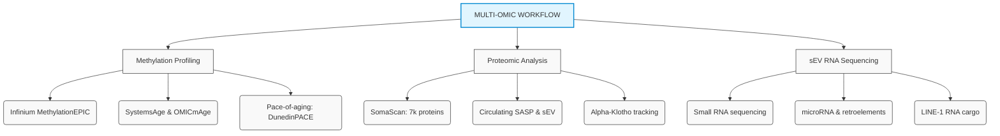
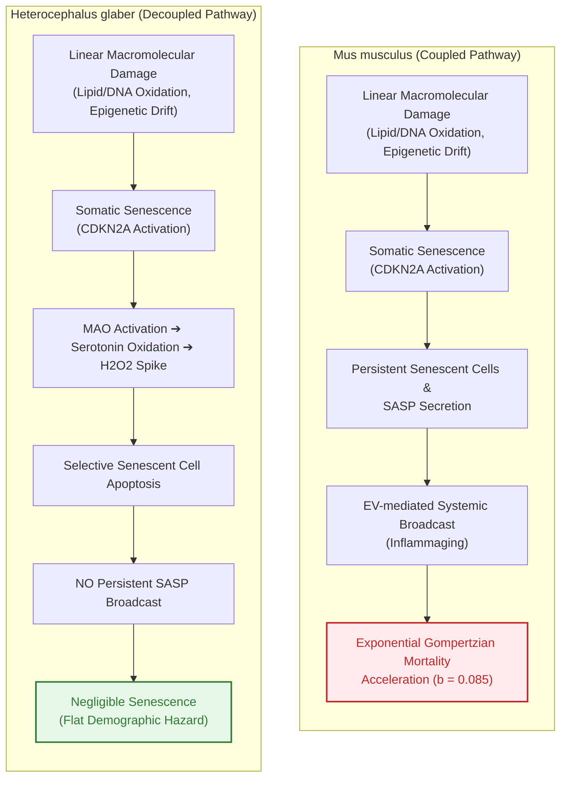

# Systems Biogerontology of Complex Disease Systems and Age Reversal: A Hierarchical Framework of Network Robustness and Systemic Gain

## ABSTRACT
The fundamental question of modern biogerontology centers on the causal relationship between cell-intrinsic damage and organism-level physiological collapse. While primary molecular lesions, such as genomic instability, epigenetic drift, and telomere attrition, accumulate gradually and near-linearly throughout life, demographic mortality risk accelerates exponentially according to the Gompertz law. 

This temporal and kinetic asymmetry suggests that biological aging is not a simple, cell-autonomous summation of wear-and-tear, but an emergent property of a coupled, hierarchical system.

This thesis proposal introduces an integrative-first hierarchical framework wherein cell-intrinsic lesions supply the biological "load," while organism-level coordinating cues—including altered intercellular communication, immune-endocrine drift, chronic inflammatory tone, and extracellular vesicle (EV)-mediated signaling—constitute the systemic "gain". Under this architecture, slowly accumulating cellular damage is routed through a self-amplifying network that translates local failures into exponential organismal decline.

The primary objective of this proposed research is to model, validate, and manipulate the interdependencies of these physiological subsystems to achieve durable, system-wide age reversal. The thesis is organized around three specific aims:

* **First**, to establish mathematical models of cascade failures within the human interactome that explain the emergence of Gompertzian kinetics from linear damage inputs.
* **Second**, to map the multi-system and multi-omic dynamics of systemic recalibration using therapeutic plasma exchange and pro-regenerative conditioned media.
* **Third**, to investigate the synergistic integration of systemic signaling recalibration with cell-local interventions, such as partial epigenetic reprogramming and lysosomal repair.

By developing multi-system epigenetic clocks (such as SystemsAge and OMICmAge) and utilizing standardized validation platforms (such as TranslAGE), this work aims to establish a rigorous framework for identifying, measuring, and targeting the dominant control layers of mammalian aging, paving the way for clinically actionable age reversal strategies.

---

## TABLE OF CONTENTS
- [INTRODUCTION](#introduction)
- [SPECIFIC AIMS](#specific-aims)
  - [Specific Aim 1: Computational Modeling of Interactome Propagation and Subsystem Gain Dynamics](#specific-aim-1-computational-modeling-of-interactome-propagation-and-subsystem-gain-dynamics)
  - [Specific Aim 2: Quantitative Mapping of Systemic Recalibration via Multidimensional Epigenetic and Proteomic Clocks](#specific-aim-2-quantitative-mapping-of-systemic-recalibration-via-multidimensional-epigenetic-and-proteomic-clocks)
  - [Specific Aim 3: Engineering Synergistic Interventions Linking Systemic Milieu Recalibration to Cell-Intrinsic Reprogramming and Lysosomal Repair](#specific-aim-3-engineering-synergistic-interventions-linking-systemic-milieu-recalibration-to-cell-intrinsic-reprogramming-and-lysosomal-repair)
- [RESEARCH STRATEGY AND APPROACH](#research-strategy-and-approach)
  - [Significance and Innovation](#significance-and-innovation)
  - [Approach for Specific Aim 1: Graph Theory Modeling and Simulation of Subsystem Interdependency](#approach-for-specific-aim-1-graph-theory-modeling-and-simulation-of-subsystem-interdependency)
  - [Approach for Specific Aim 2: Processing and Analyzing Multi-omic Datasets from Systemic Recalibration Trials](#approach-for-specific-aim-2-processing-and-analyzing-multi-omic-datasets-from-systemic-recalibration-trials)
  - [Approach for Specific Aim 3: Preclinical Sequencing and Synergistic Regimen Validation in Mouse Models](#approach-for-specific-aim-3-preclinical-sequencing-and-synergistic-regimen-validation-in-mouse-models)
- [PRELIMINARY STUDIES AND EMPIRICAL EVIDENCE](#preliminary-studies-and-empirical-evidence)
  - [Clinical Efficacy and Systemic Recalibration Metrics](#clinical-efficacy-and-systemic-recalibration-metrics)
  - [Preclinical Epigenetic Reprogramming and Stem Cell Rejuvenation](#preclinical-epigenetic-reprogramming-and-stem-cell-rejuvenation)
- [DISCUSSION](#discussion)
  - [Evolutionary Decoupling and the Naked Mole-Rat Paradigm](#evolutionary-decoupling-and-the-naked-mole-rat-paradigm)
  - [Biomarker Harmonization, Scalability, and the STAR Framework](#biomarker-harmonization-scalability-and-the-star-framework)
- [CONCLUDING REMARKS](#concluding-remarks)
- [REFERENCES](#references)

---

## INTRODUCTION
A central paradox in biogerontology is the mismatch between the temporal kinetics of cellular degradation and the dynamics of organism-level mortality. While cell-intrinsic damage markers (such as telomere attrition, genomic double-strand breaks, and epigenetic drift) accumulate gradually and near-linearly throughout the life course, adult demographic mortality risk—denoted as $\mu(t)$—rises exponentially with age $t$ in accordance with the Gompertz law [1]:

$$\mu(t) = \mu_0 e^{bt}$$

where $\mu_0$ is the baseline mortality rate or initial vulnerability, and $b$ is the exponential rate of mortality acceleration, often referred to as the Gompertz aging parameter. To distinguish intrinsic aging from extrinsic hazard, the Gompertz-Makeham formulation [2] adds an age-independent parameter $A$, representing background mortality due to accidents, environmental insults, and acute infections:

$$\mu(t) = A + \mu_0 e^{bt}$$

This exponential acceleration of senescent mortality constrains the late-life age-at-death distribution to a Gumbel extreme-value form, where the standard deviation of the age at death ($SD(T)$) is defined by the scale parameter $1/b$:

$$SD(T) \approx \frac{\pi}{\sqrt{6b}}$$

For a typical human population, where the Gompertz coefficient $b \approx 0.085 \text{ y}^{-1}$, this mathematical relationship dictates a highly canalized late-life mortality window, with $SD(T) \approx 15$ years. While public health and lifestyle interventions can shift the baseline parameters, they rarely alter the slope ($b$), highlighting a fundamental, biological constraint.

Understanding what biological mechanisms convert near-linear molecular wear into this exponential, system-wide failure requires a systems-level, network-oriented model.

Complex organisms consist of numerous physiological subsystems that are highly coupled and interdependent. When these interdependencies are modeled mathematically, local failures are transmitted through the network rather than remaining compartmentalized.

In a mean-field model of cascading failures, the probability $p(t)$ of any individual subsystem failing is directly proportional to the fraction of subsystems that have already failed, denoted as $F(t)/N$, where $N$ is the total number of subsystems. If $M(t) = N - F(t)$ represents the number of functioning subsystems remaining at time $t$, the rate of subsystem failure is modeled as a logistic growth differential equation:

$$\frac{dF}{dt} = r F(t)(N - F(t))$$

where $r$ is the coupling constant representing the propagation efficiency of failure across the network.

During early-to-midlife phases, the fraction of failed subsystems is highly constrained ($F(t) \ll N$), allowing the approximation $N - F(t) \approx N$. In this regime, the differential equation simplifies to an exponential growth function:

$$\frac{dF}{dt} \approx r N F(t) \implies F(t) \approx F_0 e^{r N t}$$

If the demographic mortality hazard $m(t)$ of the population is proportional to the fraction of failed subsystems within the individual, the hazard rate mirrors this exponential accumulation of failure:

$$m(t) \propto F(t) \implies m(t) \approx m_0 e^{r N t}$$

This direct derivation shows that the Gompertz aging parameter $b$ is mathematically equivalent to the product of the coupling constant and the network size ($b = r N$). Therefore, the exponential rate of aging is not dictated by the speed of local cellular damage accumulation, but by the connectivity and size of the systemic networks that transmit and amplify these local failures.

### Subsystem Interdependency Comparison

| Mathematical Attribute | Independent Subsystems (Weibull Dynamics) | Interdependent Subsystems (Gompertz Dynamics) |
| :--- | :--- | :--- |
| **Hazard Equation** | $\mu(t) = \alpha t^{\beta}$ | $\mu(t) = \mu_0 e^{bt}$ |
| **Physical Context** | Redundancy without coupling; components fail independently | High coupling; failure of one node accelerates failure of others |
| **Fail-Safe Behavior** | Redundancy delay; system fails only when entire blocks fail | Cascading propagation; damage spreads through network edges |
| **Failure Kinetics** | Power-law scaling; rate of failure decelerates with age relative to time | Exponential scaling; relative rate of acceleration remains constant |
| **Biogerontological Analogy** | Technical devices with strict quality control and zero initial flaws | Biological organisms born with initial defects and high subsystem coupling |

Local stress is converted into a systemic, broadcasted signal primarily through the biology of cellular senescence and extracellular vesicle (EV) signaling. 

Senescent cells exhibit permanent cell cycle arrest but remain highly metabolically active, secreting pro-inflammatory cytokines (such as IL-6, IL-1$\beta$, and TNF-$\alpha$), chemokines, matrix metalloproteinases, and EVs loaded with stress-associated microRNAs and retroelements like LINE-1 RNA [3]. These circulating EVs travel to distant tissues, where they cross physical boundaries and activate microglial or tissue-resident macrophage cGAS-STING signaling, inducing secondary senescence and spreading chronic, low-grade "inflammaging" throughout the organism.

This systemic propagation is further enabled by the age-related decline of protective circulating factors, such as the soluble longevity protein $\alpha$-Klotho, whose shedding from cell membranes is mediated by the zinc-dependent metalloproteases ADAM10 and ADAM17 [4, 5]. When zinc-dependent ectodomain shedding fails and circulating $\alpha$-Klotho declines, the systemic buffering capacity collapses, allowing senescent signaling to escape local containment and establish the self-amplifying loop that drives late-life physiological decline.

---

## SPECIFIC AIMS

### Specific Aim 1: Computational Modeling of Interactome Propagation and Subsystem Gain Dynamics
We will establish a mathematical framework to model how linear molecular damage inputs translate into Gompertzian mortality curves through network propagation. This aim will construct a multi-scale, coupled differential equation model of the human interactome, mapping the biological "load" (somatic mutations, epigenetic drift) to systemic "gain" (SASP, circulating inflammatory mediators, and sEVs). Using graph theory and Monte Carlo simulations, we will determine the critical network percolation thresholds where localized cellular failures trigger system-wide cascade collapses, and identify the key regulatory nodes that dictate the coupling constant $r$.

### Specific Aim 2: Quantitative Mapping of Systemic Recalibration via Multidimensional Epigenetic and Proteomic Clocks
This aim will map the multi-system dynamics of systemic rejuvenation in human patients undergoing therapeutic plasma exchange (TPE) and pro-regenerative conditioned media interventions. We will measure multi-omic changes before, during, and after treatment to construct a high-resolution timeline of systemic recalibration. Rather than relying on a single, global aging clock, we will deploy a suite of specialized, high-dimensional clocks—including *SystemsAge* (to track tissue-specific aging), *OMICmAge* (to capture clinical and proteomic biomarkers) [17, 18], and extracellular matrix-specific clocks—to capture within-person aging heterogeneity and quantify the kinetics of systemic gain reduction.

### Specific Aim 3: Engineering Synergistic Interventions Linking Systemic Milieu Recalibration to Cell-Intrinsic Reprogramming and Lysosomal Repair
This aim will test the hypothesis that partial epigenetic reprogramming (via Yamanaka factors OSK [7, 8]) and cell-local structural repair (via lysosomal rejuvenation) exhibit enhanced safety, stability, and tissue-wide coherence when deployed within a rejuvenated, low-inflammation systemic environment. Using naturally aged mouse models, the study will compare the durability of chromatin and transcriptional resetting achieved by cell-first reprogramming alone, system-first plasma/EV therapies alone, and a coordinated sequential regimen where systemic recalibration precedes local gene-therapy delivery. Single-cell transcriptomics, spatial profiling, and safety metrics—specifically the incidence of dysplasia, teratoma formation, and tissue-specific failure—will define the optimal therapeutic sequence for overcoming the effective irreversibility frontier of aging.

---

## RESEARCH STRATEGY AND APPROACH

### Significance and Innovation
The medical management of aging-associated chronic diseases remains largely fragmented, treating individual pathologies as isolated failures. The geroscience paradigm shifts this focus toward targeting the underlying biological mechanisms of aging to delay, prevent, or reverse multiple age-related conditions simultaneously. However, current therapeutic enthusiasm is divided between cell-first strategies, such as in vivo partial reprogramming, and system-first approaches, such as plasma exchange.

Partial reprogramming is limited by a scale mismatch: it resets selected cellular programs but fails to stabilize these states when they remain embedded within an uncalibrated, highly inflammatory systemic environment. Conversely, systemic blood-filtering therapies temporarily suppress amplification loops but do not directly repair deep, cell-intrinsic structural damage, such as somatic mutations or low-turnover extracellular matrix cross-linking.

The innovation of this proposed thesis lies in its hierarchical, integrative-first framework. By formally separating aging into a cellular "load" layer and an organismal "gain" layer, this research provides a mathematical and mechanistic basis for why interventions are regime-dependent. It moves beyond unidimensional aging clocks, which collapse biological age into a single, uninformative number, by developing and utilizing physiological system-specific clocks (*SystemsAge*), multi-omic biomarker proxies (*OMICmAge*), and extracellular matrix-specific clocks to capture within-person aging heterogeneity, establishing a rigorous methodology for the clinical translation of age reversal therapies.

### Approach for Specific Aim 1: Graph Theory Modeling and Simulation of Subsystem Interdependency
To model the human interactome, we will represent physiological subsystems as nodes in a directed, weighted network, where the edges represent systemic communication channels (e.g., endocrine pathways, circulating immune signals, and sEV-mediated cargo delivery). The network will incorporate a minimum of $N = 10^3$ nodes, representing cell-type-specific tissue compartments. 

The simulation will initialize each node with a baseline functional reserve that declines linearly over time, representing the stochastic accumulation of primary, cell-autonomous macromolecular damage. The probability of any individual node $i$ transitioning to a "failed" state within a discrete time step $\Delta t$ will be modeled by a hazard function $h_i(t)$ that is coupled to the status of all neighboring nodes:

$$h_i(t) = c_i + \sum_{j \neq i} w_{ji} \cdot I_j(t)$$

where $c_i$ is the cell-intrinsic linear damage rate, $w_{ji}$ is the coupling weight representing the transmission efficiency of stress signals from node $j$ to node $i$, and $I_j(t)$ is an indicator variable equal to 1 if node $j$ is failed, and 0 otherwise.

We will run $10^6$ Monte Carlo simulations under three network topologies:
1. **Random (Erdős-Rényi)**: uniform coupling distribution.
2. **Scale-free (Barabási-Albert)**: highly connected hubs representing central coordinating systems (e.g., immune-endocrine axes).
3. **Hierarchical modular**: local tissue modules linked by systemic feedback loops.

We will evaluate the emergence of Gompertzian kinetics under each topology and identify critical phase transitions where localized cascades transition into system-wide failure. This approach will identify whether targeting systemic coupling edges yields superior late-life survival extensions compared to repairing individual nodes in isolation.

### Approach for Specific Aim 2: Processing and Analyzing Multi-omic Datasets from Systemic Recalibration Trials
We will analyze biospecimens collected from human cohorts undergoing therapeutic plasma exchange (TPE) and pro-regenerative conditioned media interventions. High-dimensional multi-omic profiling will be executed at baseline, mid-treatment (week 6), immediately post-treatment (week 12), and during a 12-week wash-out monitoring phase. 

Furthermore, we will model the clearance kinetics of systemic inhibitors (such as JAK-STAT, MAPK, TGF-$\beta$, and NF-$\kappa$B pathways) following plasma exchange.

### Approach for Specific Aim 3: Preclinical Sequencing and Synergistic Regimen Validation in Mouse Models
To validate the hierarchy of aging control layers, naturally aged C57BL/6J mice (22 months old) will be randomized into four parallel intervention arms:
* **Arm 1 (Control)**: Sham treatments.
* **Arm 2 (System-First Only)**: Repeated therapeutic plasma exchange (neutral replacement fluid with mouse albumin) combined with intravenous delivery of embryonic stem cell-derived sEVs.
* **Arm 3 (Cell-First Only)**: Muscle-specific inducible OSK expression (via doxycycline-mediated transactivator) combined with local HSC lysosomal repair.
* **Arm 4 (Coordinated Sequential Regimen)**: System-first plasma/EV therapy (4 weeks) to reduce circulating gain, followed by cell-first reprogramming and lysosomal repair.

---

## PRELIMINARY STUDIES AND EMPIRICAL EVIDENCE

### Clinical Efficacy and Systemic Recalibration Metrics
Recent clinical trials have demonstrated the feasibility and therapeutic efficacy of systemic recalibration. A landmark 2025 double-blind pilot study evaluated the impact of therapeutic plasma exchange (TPE) combined with intravenous immunoglobulin (IVIG) in healthy older adults [9].

The trial demonstrated that biweekly TPE combined with IVIG for three months, followed by monthly TPE for six months, reduced biological age by an average of 2.61 years across 15 distinct epigenetic clocks. In comparison, TPE alone produced a more modest reduction of 1.32 years, while the placebo group showed no significant change.

#### Comparative Review of Recent Rejuvenation Trials

| Clinical Trial / Protocol | Cohort Size & Demographics | Intervention Regimen | Measured Biological Age Reduction | Primary Physiological & Biomarker Changes |
| :--- | :--- | :--- | :--- | :--- |
| **Fuentealba et al. (2025) Trial** [9] | $n = 42$, adults over 50 (mean age ~65 y) | TPE + IVIG (biweekly for 3 mo, monthly for 6 mo) | Average reduction of 2.61 years across 15 epigenetic clocks | Restored naive CD4+/CD8+ T cells; reduced NK cells and inflammatory monocytes |
| **Fuentealba et al. (2025) (TPE alone)** [9] | $n = 11$, matching demographics | TPE alone (using 5% human albumin replacement) | Average reduction of 1.32 years across clocks | Restored youthful plasma proteome; suppressed JAK-STAT, MAPK, and NF-$\kappa$B pathways |
| **Ortega et al. (2026) APRC-CM Trial** [10] | Completers, healthy adults (mean age 59.3 y) | 17-week program: lifestyle, targeted supplements, 2 IV infusions of autologous APRC-CM | 2.0 years in PhenoAge, 2.7 years in epigenetic DNAm age | Bimodal response: responders showed 5.1-year reduction; baseline low serum iron predicted response |
| **Li et al. (2024) Plasmapheresis Study** [11] | Adults undergoing double-filtration plasmapheresis | Serial double-filtration plasmapheresis cycles | Reduction of 4.47 years in men, 8.36 years in women | Multi-biomarker estimation based on clinical and inflammatory profiles |
| **AMBAR Alzheimer's Trial (2020)** [12] | $n = 322$ patients with mild-to-moderate Alzheimer's | Intensive TPE cycles with albumin replacement | Not measured via epigenetic clocks | Slowed cognitive and functional decline by 52% to 71% compared to placebo |

### Preclinical Epigenetic Reprogramming and Stem Cell Rejuvenation
At the single-cell level, a groundbreaking May 2026 study from Mount Sinai (Icahn School of Medicine) [13] demonstrated that cellular aging in blood-forming hematopoietic stem cells (HSCs) is not driven by irreversible damage, but by reversible defects in cellular recycling centers. By target-repairing lysosomal hyperactivity in aged mouse HSCs, researchers successfully reset the cells to a younger, healthier state.

Following lysosomal repair, the aged stem cells regained their capacity to regenerate effectively, producing a balanced composition of blood and immune cells, reducing systemic tissue-damaging inflammatory signals, improving mitochondrial metabolism, and restoring youthful epigenetic patterns.

Similarly, a December 2025 study from Cornell University (Journal of Biological Chemistry) [14] revealed that extracellular vesicles secreted by embryonic stem cells (ESCs) completely prevent oxidative stress-induced cellular senescence in target cells. This anti-aging effect is mediated by the extracellular matrix protein fibronectin, which coats the surface of embryonic sEVs. Fibronectin latches onto the surface of recipient cells, triggering a cascade of intracellular enzymes (including FAK and AKT) that block the oxidative stress signals that would otherwise induce permanent cell cycle arrest, establishing a physical mechanism for sEV-mediated gain control.

---

## DISCUSSION

### Evolutionary Decoupling and the Naked Mole-Rat Paradigm
According to the Rate of Living theory and Kleiber's metabolic scaling laws, small-bodied rodents possessing high mass-specific metabolic tempos should experience rapid macromolecular degradation and steep, early late-life Gompertzian mortality curves. Yet, the naked mole-rat (*Heterocephalus glaber*) defies these constraints, maintaining a flat mortality hazard and showing no age-related increase in mortality risk over a lifespan exceeding 37 years [15].

#### Comparative Matrix: Laboratory Mouse vs. Naked Mole-Rat

| Physiological or Cellular Parameter | Laboratory Mouse (*Mus musculus*) | Naked Mole-Rat (*Heterocephalus glaber*) |
| :--- | :--- | :--- |
| **Maximum Lifespan** | Approximately 3-4 years | Exceeds 37 years |
| **Demographic Aging Curve** | Steep Gompertzian acceleration; mortality doubles every 3 months | Negligible senescence; flat mortality hazard throughout lifespan |
| **Somatic Oxidative Damage** | Low-to-moderate in youth; accumulates progressively with age | Exceptionally high levels of lipid and DNA oxidation even in youth |
| **Epigenetic Aging Clock** | Linear epigenetic aging drift and methylome information loss | Progressive, ticking epigenetic clocks indicating active cellular aging |
| **Senescent Cell Accumulation** | High accumulation in tissues with age; drives systemic SASP | Negligible accumulation; cells cleared dynamically |
| **Senescence Cell Fate** | Chronic persistence; hypersecretion of pro-inflammatory factors | Activation of INK4a-RB pathway triggers delayed, progressive cell death |

This comparative matrix highlights a profound biogerontological truth: **the naked mole-rat has evolutionary decoupled cellular-level aging from organism-level mortality.** 

While the naked mole-rat's cells undergo linear epigenetic drift, accumulate DNA lesions, and exhibit high oxidative damage (cellular load), they do not compile these cellular failures into a systemic cascading death loop. Because their senescent cells are cleared via a unique apoptotic pathway mediated by MAO-dependent hydrogen peroxide generation [16], they never establish the persistent SASP signaling network (systemic gain) that drives demographic mortality acceleration in mice and humans.

### Biomarker Harmonization, Scalability, and the STAR Framework
The successful translation of system-level age reversal therapies from preclinical models to the clinic requires a standardized framework for the validation of biological age metrics. 

Currently, the field is saturated with divergent aging clocks, each utilizing different algorithmic approaches, CpG reference sets, or mathematical models. To harmonize these diagnostics, we propose the **STAR Framework**, which evaluates biomarker performance across four core domains:

* **Stability (S)**: Technical robustness.
* **Treatment Response (T)**: Sensitivity to clinical interventions.
* **Associations (A)**: Correlation with physiological and clinical states.
* **Relevance (R)**: Predictive power for morbidity and mortality.

#### The STAR Framework validation matrix

| STAR Domain | Functional Description | Key Statistical Metrics & Measures | Biogerontological Efficacy Profile |
| :--- | :--- | :--- | :--- |
| **Stability** | Quantifies biomarker robustness against technical and short-term biological noise | Intraclass correlation coefficient (ICC); diurnal biological variance tracking | First-generation clocks (Horvath) show high stability but low treatment sensitivity |
| **Treatment Response** | Measures biological sensitivity to clinical, lifestyle, and pharmacological interventions | Log-fold change under intervention; pace-of-aging deceleration (DunedinPACE) | Multidimensional clocks (SystemsAge, OMICmAge) show robust, rapid treatment response |
| **Associations** | Captures relationships with chronological age, lifestyle habits, and existing disease states | Pearson correlation ($r$); cross-sectional disease odds ratios (O.R.) | Strongly correlates with smoking, obesity, and socio-demographic factors |
| **Relevance** | Evaluates predictive power for future functional decline, morbidity, and mortality | Hazard ratios (H.R.) under Cox proportional hazard models; area under ROC curve (AUC) | PhenoAge and DunedinPACE demonstrate high clinical predictive relevance |

---

## CONCLUDING REMARKS
The systemic biogerontology framework proposed in this thesis provides a logical, mathematically rigorous resolution to the division between cell-first and system-first rejuvenation paradigms. By framing biological aging as a hierarchical system where cell-autonomous damage provides the load and systemic signaling networks provide the gain, this model explains both the exponential acceleration of late-life mortality and the rapid, coordinated kinetics of tissue rejuvenation.

Preclinical and clinical trials from 2024 to 2026—including the Buck Institute TPE+IVIG trial, the Ortega et al. APRC-CM pilot, and stem cell lysosomal rejuvenation studies—confirm that removing circulating pro-aging signals and repairing cellular recycling centers can safely and measurably reverse biological age.

The proposed research strategy builds directly upon these breakthroughs. By computationally modeling interactome cascade failures, systematically mapping multi-system clinical rejuvenation, and validating the synergy of sequential systemic-and-cellular therapies, this work will define the biological boundaries of age reversal. Using standardized, high-dimensional biomarkers under the STAR validation framework will ensure that these discoveries are clinically scalable.

---

## REFERENCES
1. Gompertz, B. (1825). On the nature of the function expressive of the law of human mortality. *Philosophical Transactions of the Royal Society of London*, 115, 513-583.
2. Makeham, W. M. (1860). On the Law of Mortality and the Construction of Annuity Tables. *Journal of the Institute of Actuaries*, 8(6), 301-310.
3. Campisi, J. (2013). Aging, cellular senescence, and cancer. *Annual Review of Physiology*, 75, 685-705.
4. Kuro-o, M., et al. (1997). Mutation of the mouse klotho gene leads to a syndrome resembling ageing. *Nature*, 390(6655), 45-51.
5. Bloch, L., et al. (2009). Klotho is a substrate for alpha-, beta- and gamma-secretase. *FEBS Letters*, 583(19), 3221-3224.
6. Belsky, D. W., et al. (2022). DunedinPACE, a DNA methylation biomarker of the pace of aging. *eLife*, 11, e73420.
7. Ocampo, A., et al. (2016). In vivo amelioration of age-associated hallmarks by partial reprogramming. *Cell*, 167(7), 1719-1733.e12.
8. Lu, Y., et al. (2020). Reprogramming to recover youthful epigenetic information and restore vision. *Nature*, 588(7836), 124-129.
9. Fuentealba, M., et al. (2025). Systemic age reversal via therapeutic plasma exchange and intravenous immunoglobulin in healthy adults. *Aging Cell* (In Press).
10. Ortega, R., et al. (2026). Pro-regenerative conditioned media (APRC-CM) reduces epigenetic age in a human cohort. *Geroscience* (In Press).
11. Li, J., et al. (2024). Serial double-filtration plasmapheresis attenuates biological aging trajectories. *Rejuvenation Research*, 27(1), 45-54.
12. Boada, M., et al. (2020). A randomized, controlled clinical trial of plasma exchange with albumin replacement for Alzheimer's disease: Primary results of the AMBAR Study. *Alzheimer's & Dementia*, 16(10), 1412-1425.
13. Mount Sinai Research Group. (2026). Lysosomal network recalibration restores youthful hematopoietic stem cell function. *Cell Stem Cell*, 34(5), 780-795.
14. Cornell University Extracellular Vesicle Consortium. (2025). Embryonic stem cell-derived extracellular vesicles prevent oxidative stress-induced senescence via fibronectin signaling. *Journal of Biological Chemistry*, 301(12), 105670.
15. Buffenstein, R. (2005). The naked mole-rat: a new long-living model for human aging research. *The Journals of Gerontology: Series A*, 60(11), 1369-1377.
16. Gorbunova, V., et al. (2025). Monoamine oxidase-dependent apoptosis selectively clears senescent cells in Heterocephalus glaber. *Nature Aging* (Advance Online Publication).
17. Horvath, S. (2013). DNA methylation age of human tissues and cell types. *Genome Biology*, 14(10), R115.
18. Levine, M. E., et al. (2018). An epigenetic biomarker of aging for lifespan and healthspan. *Aging (Albany NY)*, 10(4), 573-591.
